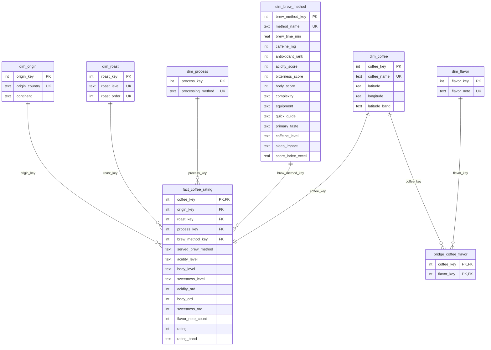

# Data Model

The warehouse (`warehouse.db`, SQLite, gitignored) is rebuilt by `python -m pipeline` from files already in this repo.
DDL: [`pipeline/schema.sql`](../pipeline/schema.sql). Column-level detail: [DATA_DICTIONARY.md](DATA_DICTIONARY.md). Checks: [DATA_QUALITY.md](DATA_QUALITY.md).

## Sources and provenance (as the repo shows it)

| Source | Content | What the repo says about its origin |
|---|---|---|
| `coffee_dataset.csv` (identical copy in `sql/`) | 32 coffee beans: origin, coordinates, roast, process, brew method, acidity/body/sweetness labels, flavour notes, rating | No source is documented for these rows or for how `Rating` was assigned. |
| `data/Coffee_Brewing_Dashboard_Final.xlsx` (first sheet) | 13 brewing methods with brew time, caffeine, antioxidant rank, acidity/bitterness/body scores, complexity, equipment | Built by `notebooks/BREWING_METHODS_SCRAPING.ipynb`. The notebook scrapes snippets (Wikipedia, Healthline) into a raw sheet, but the master attributes are hard-coded dictionaries whose comments cite USDA, Mayo Clinic and specialty coffee associations. Not re-verified here. |
| `sql/Beans_And_Methods_Streamlit_Dataset.sql` | The same beans and methods as CTEs, plus `method_mapping` (bean brew-method label -> canonical method) | Hand-written SQL. Parsed by `pipeline/extract.py` and reconciled with the other two sources. |

Scope note: the committed files hold **32 beans and 13 methods**. Some README prose cites "~80" records; those rows are not in this repo, so nothing in the warehouse or queries depends on that figure.

## Grain

**One row in `fact_coffee_rating` = one coffee bean listing (`Coffee_Name`) with its rating, served with one brew-method label.**
There is no time dimension and no per-customer data; ratings are single static values. With 32 rows, treat averages as descriptive, not statistically strong.

## Entity-relationship diagram

## Keys

| Table | Primary key | Unique / natural key | Foreign keys |
|---|---|---|---|
| `dim_origin` | `origin_key` | `origin_country` | none |
| `dim_roast` | `roast_key` | `roast_level`, `roast_order` | none |
| `dim_process` | `process_key` | `processing_method` | none |
| `dim_brew_method` | `brew_method_key` | `method_name` | none |
| `dim_coffee` | `coffee_key` | `coffee_name` | none |
| `dim_flavor` | `flavor_key` | `flavor_note` | none |
| `fact_coffee_rating` | `coffee_key` | n/a | `coffee_key`, `origin_key`, `roast_key`, `process_key`, `brew_method_key` |
| `bridge_coffee_flavor` | (`coffee_key`, `flavor_key`) | n/a | `coffee_key`, `flavor_key` |

Surrogate keys are assigned deterministically (alphabetical, or light-to-dark for roast), so reloads give identical keys.
SQLite enforces foreign keys and `CHECK` constraints; the loader runs `PRAGMA foreign_key_check` after loading.

## Design notes

- **Bridge table** resolves the comma-separated `Flavor_Notes` into a many-to-many relation (tokens lower-cased and trimmed).
- **Brew-method mapping**: the beans use 14 labels (Chemex, Clever Dripper, Nel Drip, Drip Machine ...); `method_mapping` in the SQL script collapses them onto the 13 canonical methods. The original label is kept as `served_brew_method`. Methods with no bean mapped to them (Ristretto, Lungo ...) stay in `dim_brew_method`.
- **Known source quirks** (visible in DATA_QUALITY.md): `method_mapping` contains `Turkish Coffee` twice (de-duplicated), and `Score Index` differs between the workbook and the SQL script (kept as `score_index_excel`, never used).
- **Analyst-defined fields** (not in the source): `continent` (`ORIGIN_REF`), `latitude_band`, `rating_band`, the `*_ord` encodings, `caffeine_level` and `sleep_impact` (the last two reproduce the CASE rules already in the SQL script).
- **Indexes** on every fact foreign key, `rating`, and `bridge_coffee_flavor.flavor_key`.
- **`vw_coffee_flat`** pre-joins the single-valued dimensions for the analysis queries.
